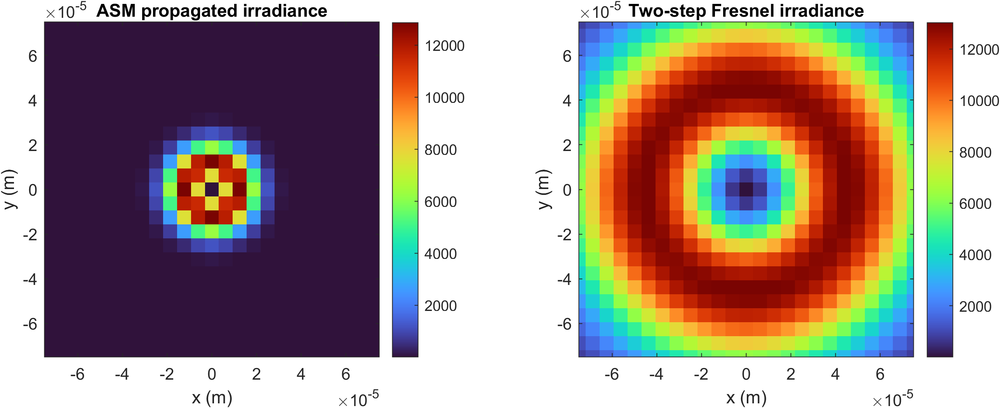
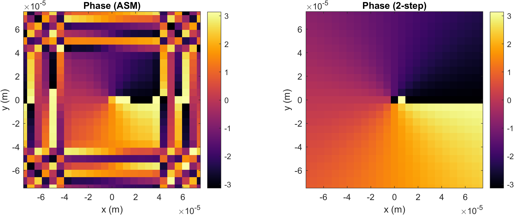

# GPU-Accelerated Optical Propagation Demo (LG Beam, ASM, 2-Step Fresnel)

This repository contains a compact, interview-ready MATLAB demonstration of  
**GPU-accelerated scalar optical field propagation** using two independent methods:

- **Angular Spectrum Method (ASM)**
- **Two-Step Fresnel Propagation with Scaling** (Voelz formulation)

The workflow generates a Laguerre–Gaussian beam, propagates it through free space or a thin lens, and produces quantitative **intensity and phase comparisons** between the two propagation techniques.

<p align="center">
  
  
</p>

*(The images above were generated directly from the provided MATLAB scripts.)*

---

## ✦ Features

- **Laguerre–Gaussian (LG) mode generator** (`lg_mode_2d.m`)
- **GPU-accelerated FFT propagation** using `gpuArray`
- **Angular Spectrum Method (ASM)**
- **Two-Step Fresnel Scaling Propagator** (Voelz, Appendix B)
- **Thin-lens quadratic phase operator** (Goodman)
- **Sampling & Fresnel number diagnostics**
- **Optional ring aperture mask**
- **Visualization of intensity & phase differences**

All propagation is performed on the **GPU**, and results are **gathered only for visualization**, minimizing unnecessary data transfers.

---

## ✦ File Overview

```
main_propagation_demo.m     → Main script (LG beam, propagation, plots)
lg_mode_2d.m                → LG(p,l) mode generator
two_step_fresnel_gpu.m      → Fresnel scaling GPU propagator (Voelz)
angular_spectrum_gpu.m      → Angular Spectrum Method (ASM)
thin_lens_phase_gpu.m       → Thin-lens phase operator
sampling_criterion.m        → Sampling check (Voelz)
fresnel_number_criterion.m  → Fresnel number diagnostic
ring_aperture_mask_gpu.m    → Optional ring aperture (annulus)
draw_circle.m               → Helper for mask generation
center_overlay.m            → Helper for mask placement

/assets
    intensity_ASM_vs_2step.png
    phase_ASM_vs_2step.png
```

---

## ✦ Requirements

- MATLAB R2020b or later  
- Parallel Computing Toolbox  
- NVIDIA GPU with CUDA support  
- (Optional) Image Processing Toolbox for enhanced visualization  

---

## ✦ Usage

Run the main script:

```matlab
main_propagation_demo
```

Toggle main options:

```matlab
use_lens     = 1;     % include thin lens operator
use_pup      = 0;     % enable ring aperture mask
save_figures = 0;     % save PNG figures
```

Modify LG beam:

```matlab
p = 0;    % radial index
l = 1;    % azimuthal index
```

Adjust simulation window and sampling:

```matlab
L_input = 1.28e-2;   % meters
M = 2048;            % samples per dimension
z = 0.30;            % propagation distance
```

---

## ✦ References

- **D. G. Voelz**, *Computational Fourier Optics*, SPIE Press  
  - Two-step Fresnel scaling (Appendix B)  
  - Thin-lens transform (Eq. 6.12)  

- **J. W. Goodman**, *Introduction to Fourier Optics*  
  - Thin-lens phase transmittance  
    - 2nd Ed., Sec. 5-2  
    - 3rd Ed., Sec. 4.2.2  

---

## ✦ License

MIT License (or update if desired)
